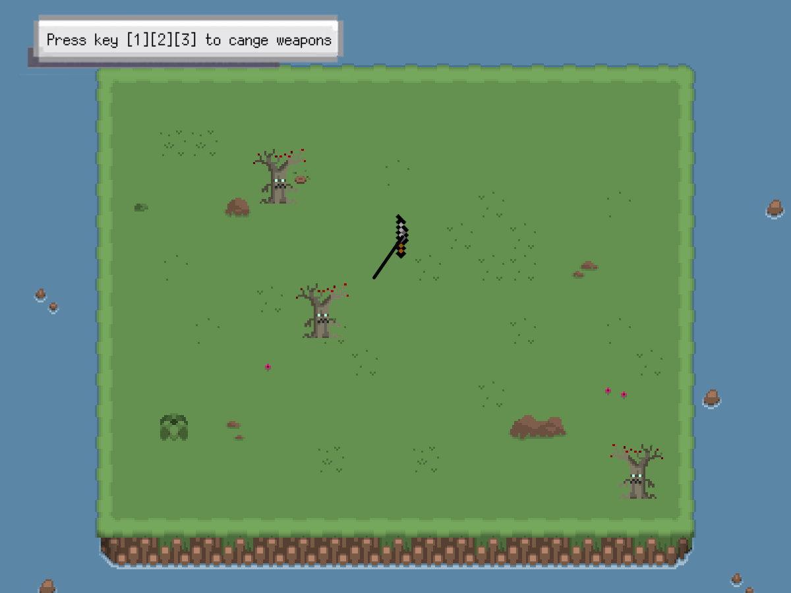

# HeavyBlade
こちらは学部2年生の李豪傑の作品です。
(Processing)[https://processing.org/]というプログラミング言語で開発しています。
Processingのダウンロードは(こちら)[https://processing.org/download]からできます。

## 作品概要
Heavy Bladeは、引っ張りアクションで剣を振り回して敵を叩き落とす新感覚ゲームです。剣を引っ張ったときの抵抗から剣の重さを表現しています。マウスドラッグで剣を操り、敵をステージ外に落としましょう。

## 操作方法
マウスで剣をドラッグして、振り回すことができます。
剣の3種類で、それぞれ重さが異なります。剣の種類は`1`, `2`, `3`のキーを押すと変更できます。

